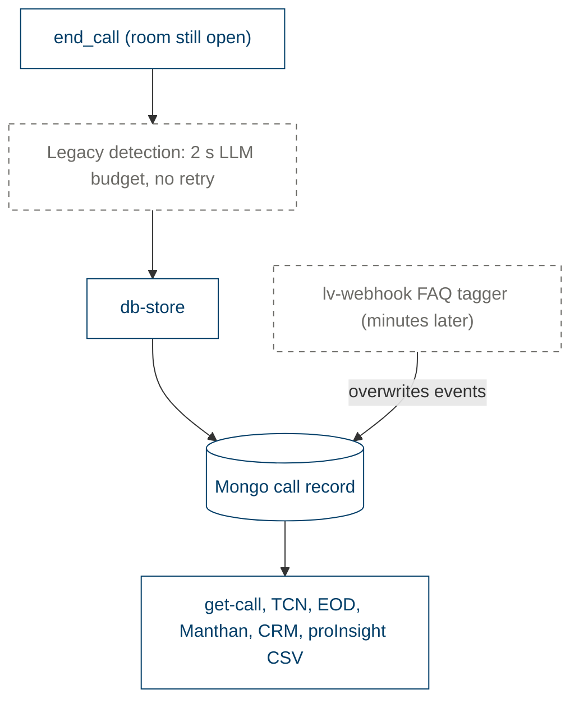
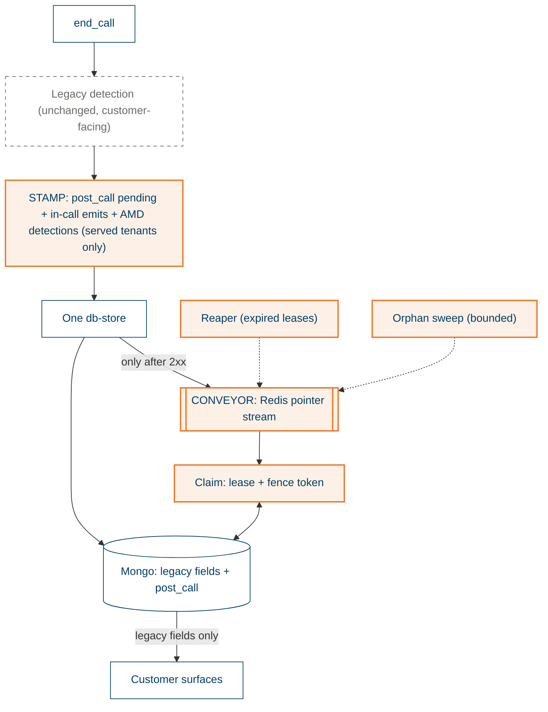
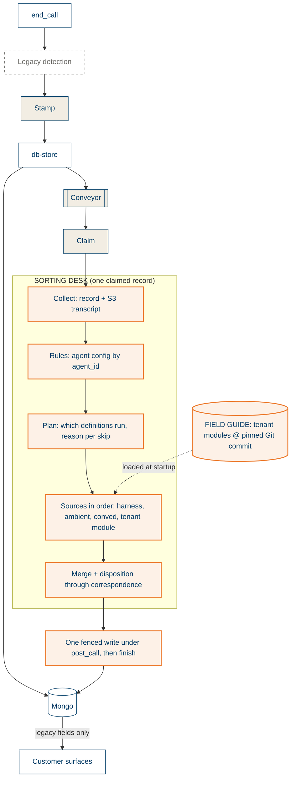
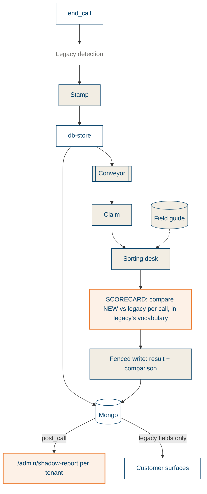
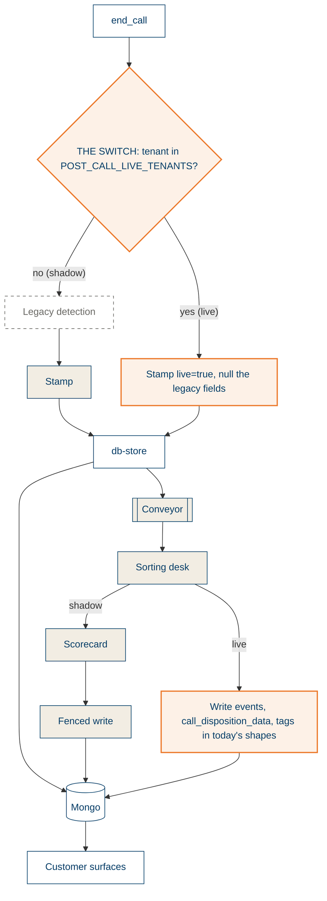
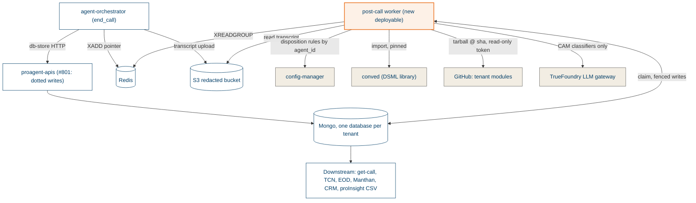

# Board

## Today's flow and what breaks

A miss is permanent and invisible. Two writers race on the same field. Nothing measures quality.

## Pass 1: Stamp and Conveyor

## Pass 2: Sorting desk and Field guide

## Pass 3: Scorecard

## Pass 4: The Switch

Rollback is removing the tenant from the list. Calls that end afterwards run legacy again; calls already stamped live keep the worker's result.

## Context: who talks to whom

