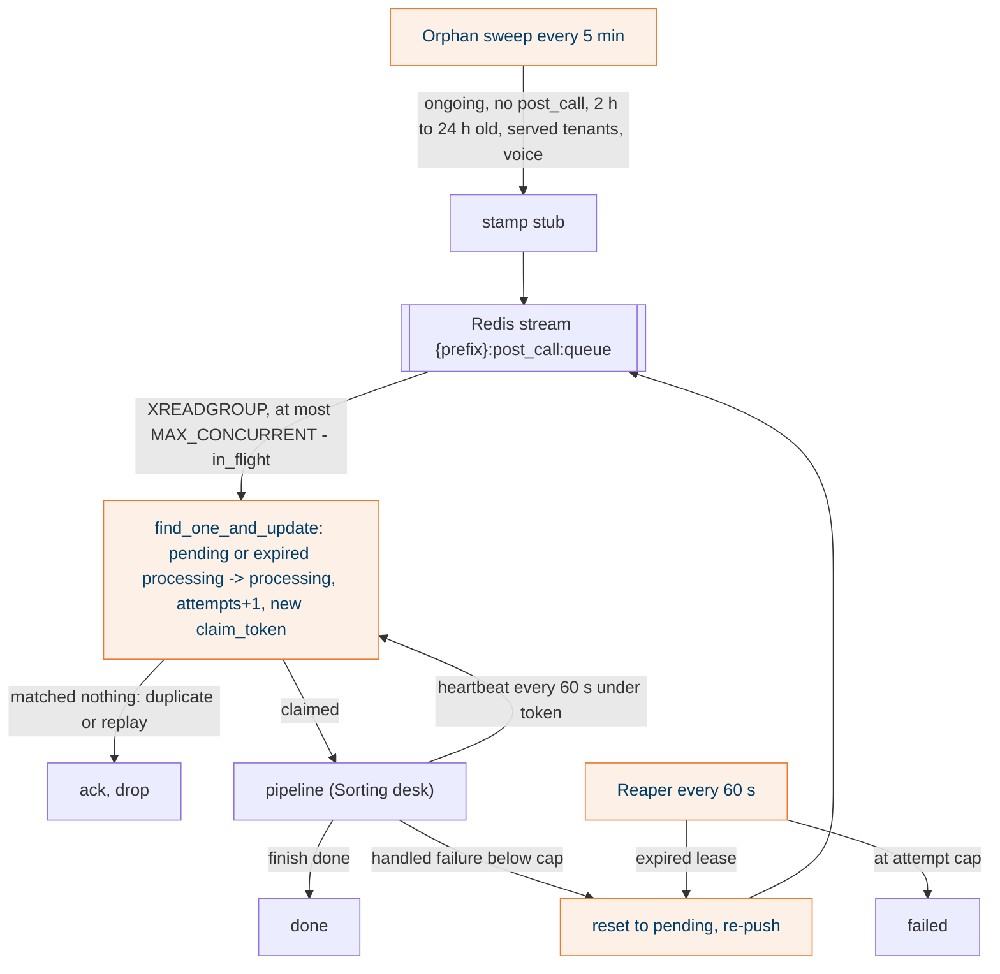
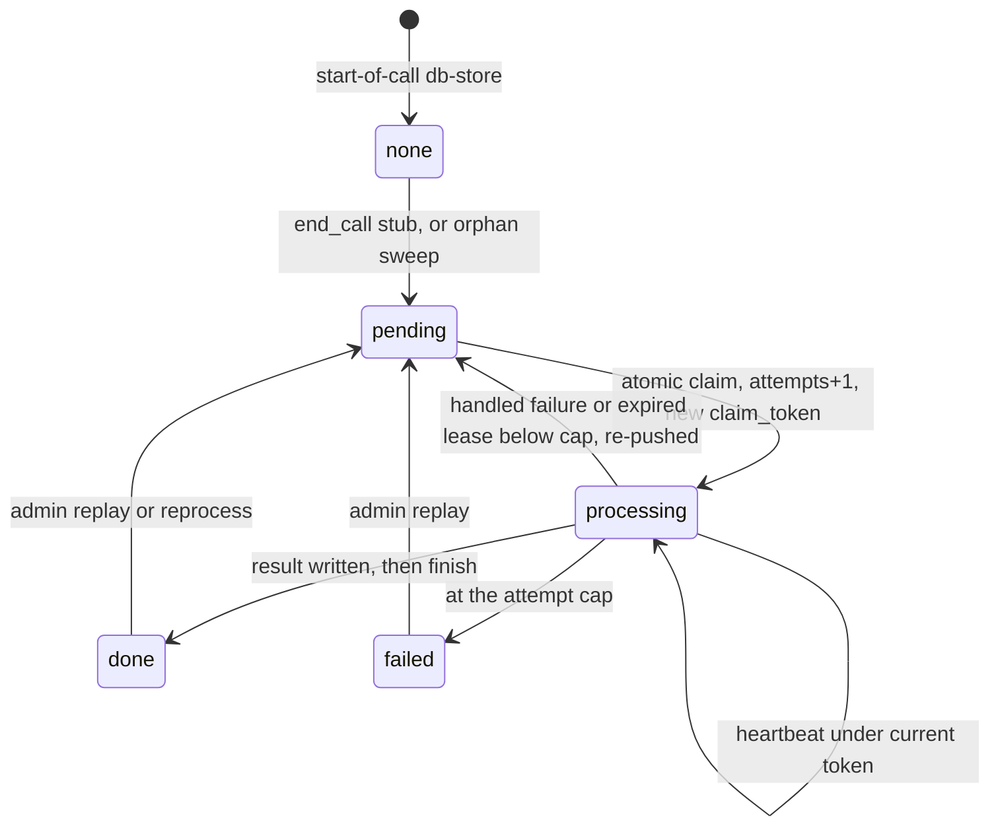

## What it does

Carries a stamped record from `end_call` to a worker replica and guarantees it gets handled once. Mongo is the truth; the Redis stream is only an index. A worker claims the record atomically under a 180 s lease with a per-claim fence token. A reaper requeues expired leases; a bounded orphan sweep stamps ended calls whose db-store never landed.

## Why this way

- Polling Mongo for `pending` was rejected: one database per tenant means enumerating tenants on every tick (R1E-1).
- The fence token is per claim, not per process. The reaper shares the worker process, so a reclaim often carries the same `WORKER_ID` (T1-24).
- Every write, heartbeat and `finish` reports whether it landed. A run that lost its claim logs `post call write fenced out` and reports no outcome, so metrics never double count.
- The sweep has a lookback floor (24 h), a tenant filter and voice-only, because the prod database is shared with UAT and the first run must not backfill years.

## How it works

## States

Known gap R1E-O11 (#986): a pointer lost after the stub was stored leaves the record `pending` forever. The sweep ignores records that already have `post_call`. Today an alarm surfaces it and `/admin/replay` recovers it.

## Traceability

| Requirement or decision | Where | Pinned by |
|---|---|---|
| R1E-1 stream as index, Mongo as truth | `queue/redis_queue.py`, `store/mongo.py` | T1-20, T1-22 |
| Fencing on every write | `store/mongo.py`, `store/memory.py` | T1-24, T1-25, `test_pipeline_shell.py` lost-claim cases |
| Reaper and attempt cap | `loops/reaper.py` | T1-13 to T1-15 |
| Bounded sweep | `loops/sweep.py`, `loops/databases.py` | T1-16, `test_sweep.py` |
| Dead consumer reclaim | `loops/claim.py` (XAUTOCLAIM 300 s) | T1-21 |
| End to end on real services | `tests/integration/post_call_worker/test_worker_end_to_end.py` | CI job `post-call-tests` |

## Decisions and assumptions on this chunk

Filled from the ledger by chunk id.

## Review entry points

1. `store/mongo.py`: the claim query and the fence filter. Every update must carry `claim_token`.
2. `loops/sweep.py`: the four bounds. Ask what the first prod run would touch.
3. `test_worker_end_to_end.py`: read it top to bottom; it exercises claim, reap, retry and duplicate pointers against real Mongo and Redis.
