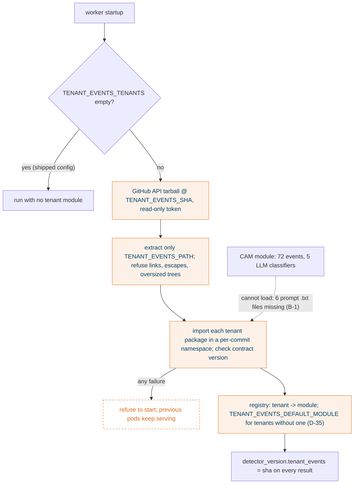

## What it does

Tenant-specific event definitions are hand-written Python modules following `tenant_events/contract.py` (D-31). At startup the worker downloads the repository tarball at `TENANT_EVENTS_SHA` with a read-only token, extracts only the definitions path, and imports each listed tenant's package in a namespace per commit. CAM's module, ported from its Bifrost notebook, is the first and currently the only one.

## Why this way

- The Bifrost extractor, registry and catalog (D-28 to D-30) were deferred so the worker could ship (D-31). A pinned commit gives reproducibility and rollback without them.
- A worker that cannot load a listed module refuses to start, and the previous pods keep running. Build-then-swap, never a half-loaded registry.
- The loader refuses links, members resolving outside the cache, and trees over 5,000 members or 100 MB. The token has `contents` read only.
- Nothing detects drift between a module and the notebook it came from. The parity bench (open PR #970) is the manual check before a commit bump.

## How it works

## States

None. Definitions change only by redeploy with a new `TENANT_EVENTS_SHA`.

## Traceability

| Requirement or decision | Where | Pinned by |
|---|---|---|
| D-31 pinned Git commit | `tenant_events/loader.py` | `test_loader.py` |
| Tarball safety limits | `tenant_events/loader.py` | loader tests on links, escapes, size |
| Contract version check | `tenant_events/contract.py`, `tenant_events/runner.py` | `test_runner.py` |
| D-35 default module | `definitions.py` | `test_definitions.py` |
| CAM port fidelity | `tenant_event_modules/cam_use2_000/` | 14 tests, all skipped until B-1 clears |

## Decisions and assumptions on this chunk

Filled from the ledger by chunk id.

## Review entry points

1. `tenant_events/loader.py`: this is the code that executes downloaded Python. Read all of it.
2. `tenant_event_modules/cam_use2_000/`: skim, it is 4,969 lines ported from a notebook. The question for you is D-35: is running CAM's module on every proAgent tenant worth anything, given most CAM events are CAM-specific?
