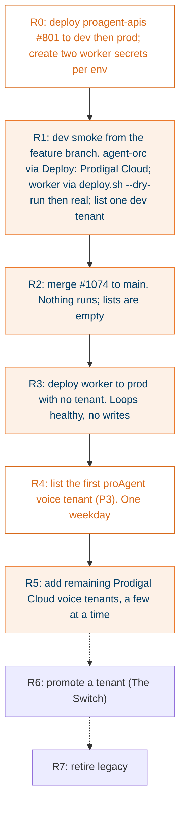

## What it does

Everything needed to run the worker somewhere other than a laptop: a Python 3.12 image (conved needs 3.12), TrueFoundry specs for dev and prod, a manual deploy workflow, CI that runs Mongo and Redis as service containers, a local stack playbook that runs the whole call path on one machine, and the runbook (deploy, turn a tenant on, metrics, alarms, stop).

## Why this way

- Own image and requirements because conved's Python and pydantic floors are above the main app's (R1E-15).
- The deploy workflow is `workflow_dispatch` only and GitHub dispatches only workflows on the default branch, so the dev smoke deploys the worker by hand with `deploy.sh`. TrueFoundry builds from the commit it is given, so no local Docker is needed.
- The local stack exists because the worker talks to Mongo directly while your laptop setup had no Mongo. It runs proagent-apis in on-prem mode (no Postgres, no Raven) with `ENV_NAME=local` so tenant resolution matches the worker's.

## How it works

Prod safety gates G1 to G9 must all hold before R4. Never run the worker in staging (shares dev's database) or UAT (shares prod's).

## States

Rollout steps R0 to R7 above. Rollback at any step: remove the tenant from the allowlist and scale the worker to zero. Legacy output is never touched.

## Traceability

| Requirement or decision | Where | Pinned by |
|---|---|---|
| R1E-10 chat backend as deployment template | `Dockerfile.post_call_worker`, `deployment/post-call-worker/` | not built anywhere yet |
| G7 Mongo paths run against real services | `.github/workflows/post-call-tests.yml` | CI green on #1074 |
| Local stack | `deployment/local/localstack.sh`, `docs/runbooks/local-stack.md` | smoke (shadow) and smoke --live both `done` on 2026-10-07 |
| R1E-12 metrics as slog lines + CloudWatch filters | `docs/post_call_worker/runbook.md §6` | filters not created (B-3) |
| D-26, NFR-3 capacity | `deployment/post-call-worker/prod.yaml`: 2 replicas at 8 calls | gateway load unmeasured (#890) |

## Test evidence at head 5e9862c5

| Lane | Result |
|---|---|
| Python 3.11, CI dependency set | 1136 passed, 36 skipped |
| Python 3.11, full requirements | 1156 passed, 35 skipped |
| Python 3.12 with conved 0.36.3 | 1177 passed, 14 skipped (CAM, B-1) |
| 21 call_service test files vs main | identical 18 pre-existing failures on both |
| ruff, log lint | clean |

Not tested: the Docker image build, the TrueFoundry apply, any deployed run.

## Decisions and assumptions on this chunk

Filled from the ledger by chunk id.

## Review entry points

1. `deployment/post-call-worker/prod.yaml`: replicas, resources, which secret the Mongo credentials reference (C-2).
2. `docs/runbooks/local-stack.md`: run it yourself. That is the review.
