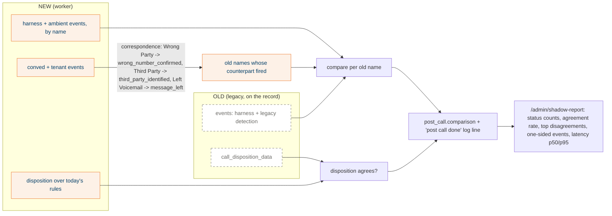

## What it does

On every shadow call the worker compares its result with legacy's on the same record and stores the comparison at `post_call.comparison`: disposition agreement, events only in legacy, events only in NEW, inference failure, and seconds from stamp to result. `GET /admin/shadow-report/{tenant}` aggregates a tenant over a window from Mongo.

The comparison works in legacy's vocabulary through a correspondence table (R2-27). It renames nothing on the record.

## Why this way

- The shadow as first built compared OLD against OLD rerun, because NEW still ran the legacy LLM pass. That was the moot case you caught on 2026-10-06. Dropping the legacy detector (D-33) and adding the correspondence made the comparison meaningful.
- Only three legacy events are inference: wrong number, third party, voicemail left. Those are the signal; NEW gets them from conved's transcript patterns instead of an LLM. The ambient events are a sanity check.
- Agreement is not quality. Neither side has been measured against labelled calls (#891). Expect disagreement wherever legacy's 2 s LLM timed out.

## How it works

Excluded from the comparison: NEW-only events (conved and tenant events with no counterpart, ambient events legacy never had), and `faq_asked`, because the FAQ tagger has not moved.

## States

None.

## Traceability

| Requirement or decision | Where | Pinned by |
|---|---|---|
| R2-27 correspondence | `apply/correspondence.py` | `test_correspondence.py` |
| FR-31 shadow stores, never touches legacy fields | `shadow.py`, `pipeline/shell.py` | T1-7, end-to-end byte-identical check |
| Report bounds (7 days, 100k records) | `admin/router.py` | `test_admin.py` |
| Latency restamped on replay | `store.mark_pending*`, `shadow.compare` | `test_shadow.py` |

## Decisions and assumptions on this chunk

Filled from the ledger by chunk id.

## Review entry points

1. `apply/correspondence.py`: the whole table fits on one screen. Every row is a product claim ("conved's Wrong Party means what our LLM meant by wrong_number_confirmed"). This is the file to argue with.
2. `shadow.py`: the module docstring explains what a one-sided event means. Read it before reading any report.
