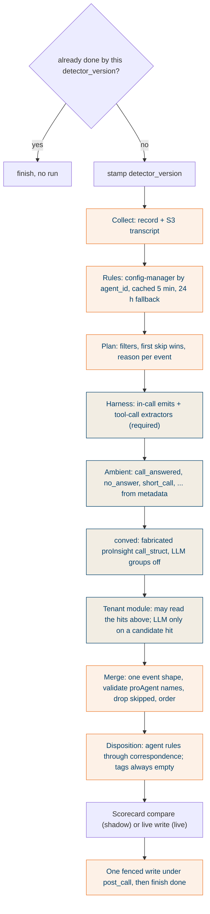

## What it does

Once per claimed record: collect the record and the S3 transcript, fetch the agent's disposition rules, run the detection core, compare, write one fenced result, finish. The core is a pure function over a read-only `CallContext` with no store, queue or bucket access, so FBT and a bench can call it with the same inputs.

NEW detection has four sources and no legacy code (D-33): the harness's own events, an ambient source over call metadata (D-34), DSML's `conved`, and the tenant module from the Field guide. There is no per-call LLM pass.

## Why this way

- Plan before run: filters decide which definitions run and record a reason for every skip, so "skipped" and "ran, nothing found" stay distinct (R2-10 to R2-17).
- Sources are isolated. A harness failure retries the call, because a disposition without tool events is wrong. Any other source failing degrades and is recorded (C-3).
- Rules are written in legacy's names and the tokenizer splits on spaces, so a conved id like `Event: CE/Consumer/Wrong Party` cannot appear in a rule. The disposition is evaluated through the Scorecard's correspondence table until naming is settled (C-4).

## How it works

Plan filters, in order: source availability, known unrunnable conved ids, short call (under 5 s), no consumer speech, modality, empty transcript, tenant filters.

## States

Per-step status under `post_call.steps` (`collect`, `rules`, `detect`, `write`), each with status, duration and error. No state machine beyond the Conveyor's.

## Traceability

| Requirement or decision | Where | Pinned by |
|---|---|---|
| R2-10 to R2-17 plan and filters | `apply/plan.py`, `apply/filters/` | `test_plan.py` |
| R2-18, R2-19 source order and isolation | `apply/run.py`, `apply/sources/` | `test_sources_*.py` |
| D-34 ambient events, parity with legacy extractors | `apply/sources/ambient_source.py` | `test_ambient_source.py` (every disconnect reason) |
| R2-7 conved call_struct fabrication | `apply/adapters/conved_struct.py` | conved lane, Python 3.12 |
| R1E-6 rules by agent_id, latest | `clients/agent_rules.py` | `test_agent_rules.py` |
| FR-15 total failure gives OTHER + inference_failed | `pipeline/core.py` | T1-2 |
| T1-4 idempotent on detector_version | `pipeline/shell.py` | T1-4 |

## Decisions and assumptions on this chunk

Filled from the ledger by chunk id.

## Review entry points

1. `pipeline/core.py` then `pipeline/shell.py`: the step order and where `finish` sits (last).
2. `apply/sources/ambient_source.py`: a table of disconnect reasons to events; check it against your mental model of the call outcomes.
3. `apply/plan.py`: confirm no filter can change the output of a definition that runs.
