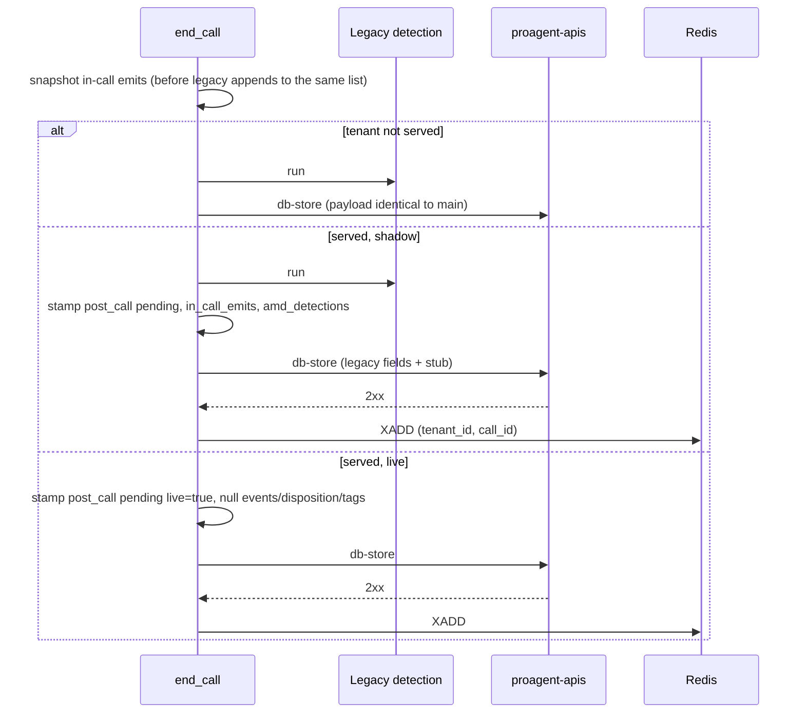

## What it does

`end_call` keeps doing what it does today. For a served tenant it also snapshots the in-call emits and AMD detections, stamps `post_call: pending` on the record, sends one db-store, and only after a 2xx pushes a `(tenant_id, call_id)` pointer to Redis. Two tenant lists decide everything, both empty by default: `POST_CALL_WORKER_TENANTS` (served) and `POST_CALL_LIVE_TENANTS` (live).

## Why this way

- One db-store carries legacy fields and the stub together, so the record exists before any worker can look for it.
- The pointer goes out only after the write landed. A pointer pushed first could be claimed, find no record, and be acked away.
- Fail-open: a Redis error logs and the call still ends normally. Losing a pointer is recoverable by replay; holding a LiveKit room is not.
- Warm-transfer children clear the post-call fields so the worker never claims them.

## How it works

## States

None of its own. It writes the first state of the Conveyor's record lifecycle.

## Traceability

| Requirement or decision | Where | Pinned by |
|---|---|---|
| FR-1 stub in the same db-store | `service/post_call_producer.py::stamp_post_call` | `test_end_call_live_switch.py` |
| G2 empty lists change nothing | `service/call_service.py::end_call` | same test, unserved branch, body compared with main |
| R1E-4 start-of-call writes never stamp pending | `schemas/types.py` (`post_call` defaults to None) | `test_precomputed.py` |
| Fail-open push | `post_call_producer.py::push_pointer` | T1-11 |
| A-9 warm-transfer children | `call_service.py` | unit test on the producer |

## Decisions and assumptions on this chunk

Filled from the ledger by chunk id.

## Review entry points

1. `service/call_service.py::end_call`: read the three branches against the sequence above. The unserved branch must be a no-op diff against main.
2. `service/post_call_producer.py`: 69 lines, the whole producer contract.
3. `utils/webhook.py`: the db-store helper now returns whether the write reached the backend and drops null post-call fields from the payload.
