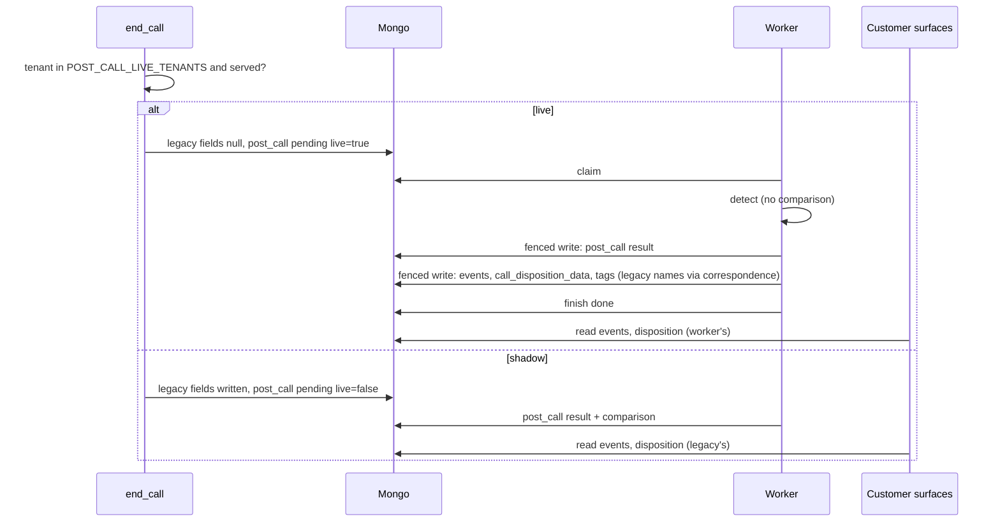
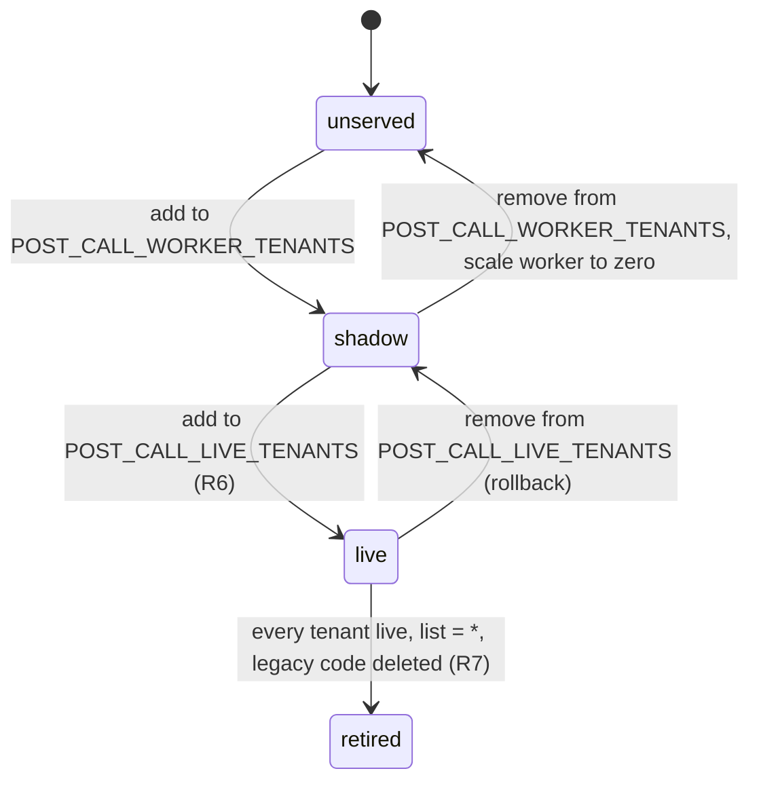

## What it does

`POST_CALL_LIVE_TENANTS` on agent-orchestrator, empty by default. For a listed served tenant, `end_call` skips legacy detection, nulls the three customer-facing fields, and stamps `post_call.live: true`. The worker obeys the stamp, never its own configuration, and after detection writes `events`, `call_disposition_data` and `tags` in today's shapes and today's names. Events with no legacy name stay under `post_call` until naming is settled (C-4).

## Why this way

- Decided once per call, stamped on the record. The two services can never disagree about who owns a call, whatever order they deploy in. A worker-wide `SHADOW_MODE` could, so it was removed (D-36).
- Rollback is removing the tenant and rolling out agent-orchestrator. Calls that end afterwards run legacy again. Calls already stamped live still get the worker's result, so no call is left with nothing.
- Retiring legacy is `*` on the list, then deleting the legacy code from `end_call` (#900).

## How it works

## States

Per tenant. A call keeps the stamp it was given, so a tenant's transition never changes a call already in flight.

## Before promoting any tenant

The switch moves who writes the result, not when consumers read it. These read at hangup or right after egress and must tolerate a result that lands seconds later, or the tenant waits:

| Consumer | Problem | Issue |
|---|---|---|
| `/calls/evaluate` to Manthan and CRM | fires after egress (median 1.6 s), can precede the worker's write | #898 |
| FAQ tagger (PFI) | lv-webhook rewrites `events` after egress; races the worker | #899 |
| TCN call-status | reads an empty disposition while pending | #933 |
| EOD files | turn a missing disposition into OTHER | #990 |
| proInsight CSV | exports before events exist | #928 |

## Traceability

| Requirement or decision | Where | Pinned by |
|---|---|---|
| D-36 per-call stamp | `service/post_call_producer.py::stamp_post_call(live=)` | `test_end_call_live_switch.py` (real end_call, three tenant kinds) |
| Live write order: result, customer fields, finish | `post_call_worker/live.py`, `pipeline/shell.py` | `test_pipeline_shell.py::TestLivePath` |
| Stamp wins over configuration both ways | `pipeline/shell.py` | same |
| Rollback and replay | end to end | `test_worker_end_to_end.py` (next call byte-identical to legacy; replay keeps the stamp) |
| Mutation check | throwaway copies broken about 30 ways | every break failed at least one test (agent-reported, not independently verified) |

## Decisions and assumptions on this chunk

Filled from the ledger by chunk id.

## Review entry points

1. `post_call_worker/live.py`: the only code that writes customer-facing fields. Small.
2. `test_end_call_live_switch.py`: runs the real `end_call`. It is skipped in CI (needs LiveKit plugins) and only passes in the full-requirements lanes. Decide whether that is acceptable.
