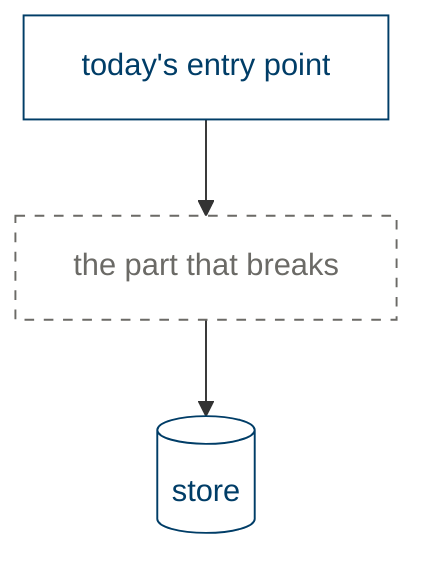
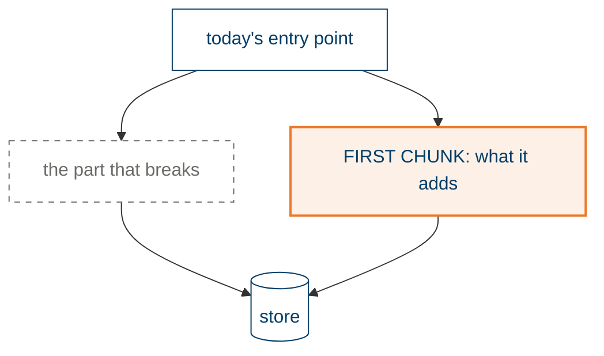
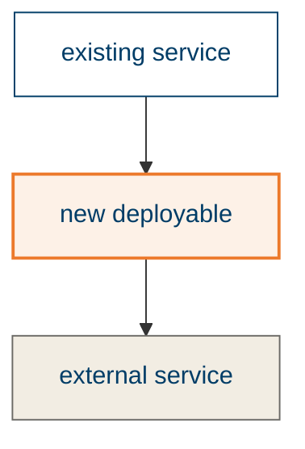

# Board

## Today's flow and what breaks

```mermaid
flowchart TD
    classDef legacy stroke-dasharray:5 5,stroke:#6B6A66,color:#6B6A66,fill:#fff
    classDef existing fill:#fff,stroke:#003D67,color:#003D67
    A["today's entry point"]:::existing --> B["the part that breaks"]:::legacy --> C[("store")]:::existing
```

One or two sentences on what fails today.

## Pass 1: First chunk

```mermaid
flowchart TD
    classDef legacy stroke-dasharray:5 5,stroke:#6B6A66,color:#6B6A66,fill:#fff
    classDef existing fill:#fff,stroke:#003D67,color:#003D67
    classDef earlier fill:#F2EDE3,stroke:#003D67,color:#003D67
    classDef new fill:#FDF1E7,stroke:#EC792B,color:#003D67,stroke-width:2px
    A["today's entry point"]:::existing --> B["the part that breaks"]:::legacy --> C[("store")]:::existing
    A --> N["FIRST CHUNK: what it adds"]:::new --> C
```

## Context: who talks to whom

```mermaid
flowchart TD
    classDef sys fill:#fff,stroke:#003D67,color:#003D67
    classDef new fill:#FDF1E7,stroke:#EC792B,color:#003D67,stroke-width:2px
    classDef ext fill:#F2EDE3,stroke:#6B6A66,color:#003D67
    APP["existing service"]:::sys --> NEW["new deployable"]:::new
    NEW --> EXT["external service"]:::ext
```
