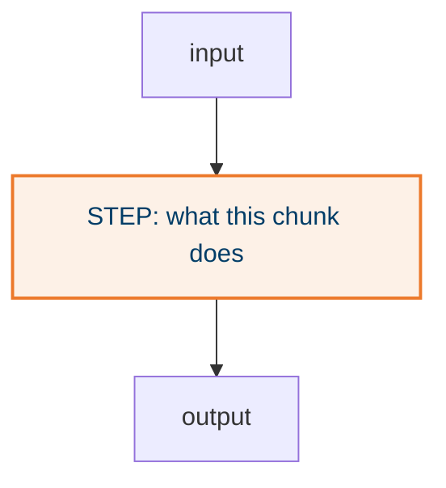

## What it does

Three to five sentences, present tense. What goes in, what comes out, who calls it.

## Why this way

- Each bullet names the alternative it beat or the failure it prevents.

## How it works

## States

None. (Or a `stateDiagram-v2` when this chunk owns a lifecycle.)

## Traceability

| Requirement or decision | Where | Pinned by |
|---|---|---|
| | | |

## Decisions and assumptions on this chunk

Filled from the ledger by chunk id.

## Review entry points

1. `path/to/file.py`: the question to ask of it.
